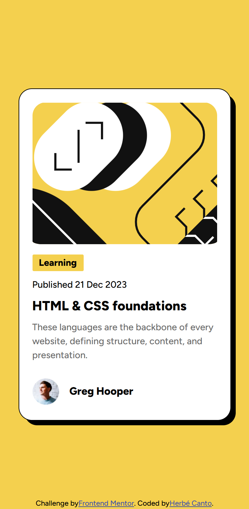

# Frontend Mentor - Blog preview card solution

This is a solution to the [Blog preview card challenge on Frontend Mentor](https://www.frontendmentor.io/challenges/blog-preview-card-ckPaj01IcS). Frontend Mentor challenges help you improve your coding skills by building realistic projects.

## Table of contents

- [Overview](#overview)
  - [The challenge](#the-challenge)
  - [Screenshot](#screenshot)
  - [Links](#links)
- [My process](#my-process)
  - [Built with](#built-with)
  - [What I learned](#what-i-learned)
  - [Continued development](#continued-development)
- [Author](#author)

## Overview

### The challenge

Users should be able to:

- See hover and focus states for all interactive elements on the page

### Screenshot



### Links

- Solution URL: [My solution](https://github.com/herbecanto/blog-preview-card__FrontEnd-Mentor)
- Live Site URL: [Site](https://herbecanto.github.io/blog-preview-card__FrontEnd-Mentor/)

## My process

### Built with

- Semantic HTML5 markup
- CSS custom properties
- Flexbox
- CSS Grid
- Mobile-first workflow

### What I learned

I learned a little about how to use grid in combination with flex for a better visual experience for the user.
I used flex in various styles, but i used grid for the card container.

```css
main {
  width: 100%;
  height: 100vh;
  display: flex;
  justify-content: center;
  align-items: center;
}
.card-container {
  height: 500px;
  width: 320px;

  background-color: var(--white);
  border-radius: 20px;

  display: grid;
  grid-template-rows: 50% 1fr 10%;

  box-shadow: 8px 8px 0px -1px #000;
  border: 1px solid black;
  padding: 20px;
}
```

### Continued development

I want to improve my skills in laying out elements using CSS, with flexbox and grid.

## Author

- Website - [Herbé Canto (in construction...)](https://herbecanto.github.io/)
- Frontend Mentor - [@herbecanto](https://www.frontendmentor.io/profile/herbecanto)
